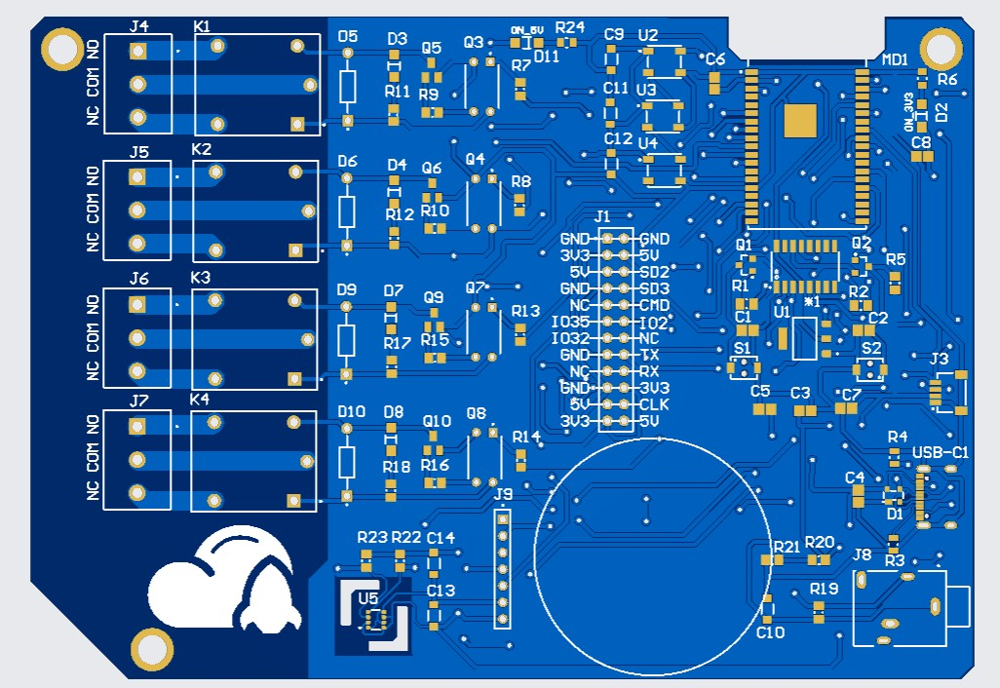

# RocketRelay
RocketRelay es una plataforma de automatización doméstica basada en ESP32, diseñada para controlar hasta cuatro relés mediante mensajes MQTT y visualizar datos ambientales en una pantalla circular TFT. El sistema integra un sensor BME680 para medir temperatura, humedad, presión y calidad del aire, y un sensor de corriente SCT-013 para monitorear el consumo eléctrico. La interfaz de usuario incluye una animación de inicio, indicadores visuales con Neopixels y un panel de control remoto usando Node-RED.

RocketRelay recibe comandos vía MQTT para activar o desactivar relés de manera individual y también publica de forma periódica los datos de los sensores. Cuando se recibe un mensaje específico, el sistema despliega los datos del sensor correspondiente en la pantalla. Además, el proyecto incluye lógica visual con colores para advertencias o actividad de sensores, y está diseñado con arquitectura no bloqueante para asegurar una respuesta rápida en todo momento.

RocketRelay se basa en los siguientes componentes:

- ESP32
- Relés
- Sensor BME680
- Sensor SCT-013
- Neopixel
- Pantalla Circular TFT

# Descripción de pines 

### Control de Relés

| Relé   | GPIO |
| :---   | :---: |
| 1      | GPIO 26|
| 2      | GPIO 25|
| 3      | GPIO 33|
| 4      | GPIO 27|

### Sensor BME680 y Sensor SCT-013 

|Sensor   | GPIO |
| :---         |    :---:|
| BME680       |  GPIO 21 (SDA)  |
| BME680       |  GPIO 22 (SCL)  |
| SCT-013       |  GPIO 34 (ADC)  |

### Pantalla Circular TFT 

|GPIO   | Función |
| :---         |    :---:|
| RST       |  GPIO 4  |
| CS      |  GPIO 5  |
| DC       |  GPIO 19  |
| SDA       |  GPIO 23  |
| SCL      |  GPIO 18  |

## Imágenes
  

               
# Licencia

Hardware License: CERN-OHL-S v2.

Software License: GPL-3.0.

