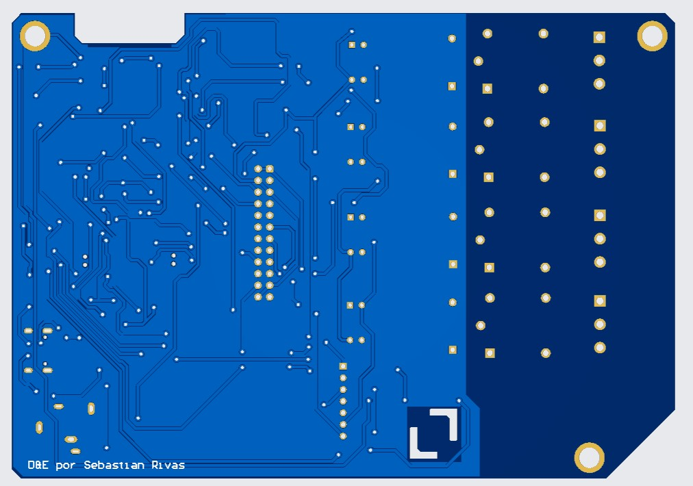
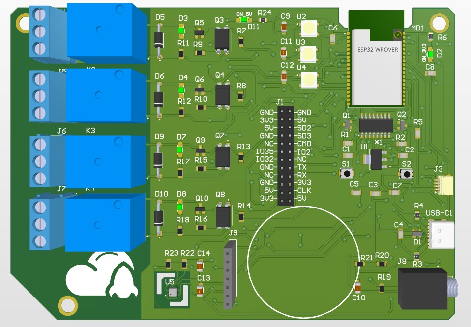
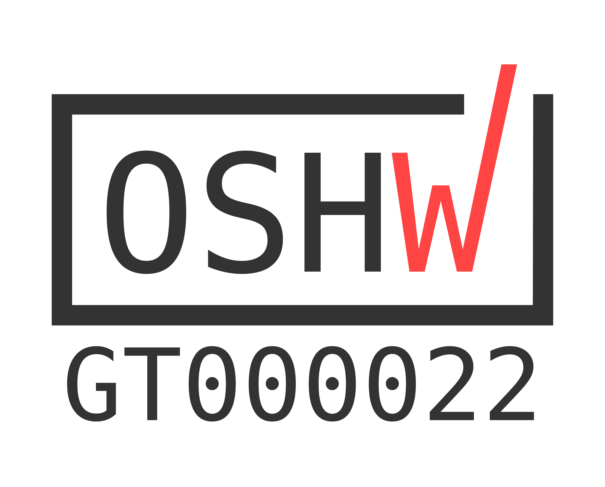

# 🚀 RocketRelay

**RocketRelay** es una plataforma de automatización doméstica basada en **ESP32**, diseñada para controlar hasta **cuatro relés AC** mediante **MQTT** y visualizar datos ambientales en una pantalla circular **TFT**.

El sistema incluye:

- Control remoto de cargas AC mediante **relés**.
- Monitoreo ambiental con sensor **BME680** (temperatura, humedad, presión y gas).
- Medición de consumo eléctrico con **SCT-013**.
- Indicadores visuales con **Neopixels**.
- Interfaz local en **pantalla TFT** y control remoto vía **Node-RED** y **bot de Telegram**.
- Todo integrado en un **shield personalizado**, certificado como **hardware libre** por OSHWA.

---

## 📦 Características principales

- ✅ Control de hasta 4 relés AC individualmente.
- 📡 Publicación periódica de datos vía MQTT.
- 📊 Visualización local en pantalla circular TFT.
- 🤖 Interacción remota mediante **bot de Telegram** con botones inline.
- 🟢 Indicadores visuales con Neopixels para actividad y alertas.
- 🧠 Arquitectura no bloqueante: respuesta rápida y estable.
- 🪛 Diseño compacto con PCB personalizado.

---

## 🧰 Componentes principales

| Componente       | Función                              |
|------------------|---------------------------------------|
| ESP32            | Microcontrolador principal            |
| 4 Relés AC       | Control de cargas eléctricas          |
| Sensor BME680    | Datos ambientales                     |
| Sensor SCT-013   | Medición de corriente                 |
| Neopixels        | Indicadores visuales (estado, alerta) |
| Pantalla TFT     | Visualización local                   |

---

## 🔌 Asignación de Pines

### 🧲 Relés

| Relé   | GPIO |
|--------|------|
| R1     | 26   |
| R2     | 25   |
| R3     | 33   |
| R4     | 27   |

### 🌫️ Sensor BME680 y ⚡ SCT-013

| Sensor       | GPIO      |
|--------------|-----------|
| BME680 SDA   | GPIO 21   |
| BME680 SCL   | GPIO 22   |
| SCT-013 (ADC)| GPIO 34   |

### 🖥️ Pantalla Circular TFT

| Función | GPIO |
|---------|------|
| RST     | 4    |
| CS      | 5    |
| DC      | 19   |
| SDA     | 23   |
| SCL     | 18   |

---

## 🖨️ Diseño de PCB

| Vista frontal | Vista trasera | PCB ensamblada |
|---------------|---------------|----------------|
|  |  |  |

---

## 🧪 Cómo usar

1. Clona el repositorio.
2. Carga el firmware en tu ESP32.
3. Conecta los sensores, pantalla y relés según el diagrama de pines.
4. Configura tu broker MQTT y WiFi.
5. Ejecuta el archivo `bot.js` en Node.js para habilitar el bot de Telegram.
6. Controla todo desde tu teléfono o una interfaz Node-RED.

---

## 🧾 Licencias

- **Hardware License**: [CERN-OHL-S v2](https://ohwr.org/project/cernohl/wikis/Documents/CERN-OHL-version-2)
- **Software License**: [GPL-3.0](https://www.gnu.org/licenses/gpl-3.0.html)

---

## 📜 Certificación OSHW

Este proyecto está certificado como **hardware libre abierto** por la **Open Source Hardware Association (OSHWA)**.

ID de certificación: **GT000022**

| Marca vertical | Marca horizontal |
|----------------|------------------|
|  |  |

Ver en el [Directorio oficial OSHWA](https://certification.oshwa.org/gt000022.html)

---

## 🙌 Agradecimientos

Gracias a la comunidad de código abierto, OSHWA, y todas las personas que contribuyeron al ecosistema de ESP32, MQTT y Node.js.  
Este proyecto fue desarrollado con fines educativos y como una herramienta de acceso abierto para entornos de automatización.

---

## 📬 Contacto

Si deseas contribuir o tienes dudas, puedes contactarme directamente.
sebastian.rivas@galileo.edu

---

🎉 ¡Gracias por usar RocketRelay!

